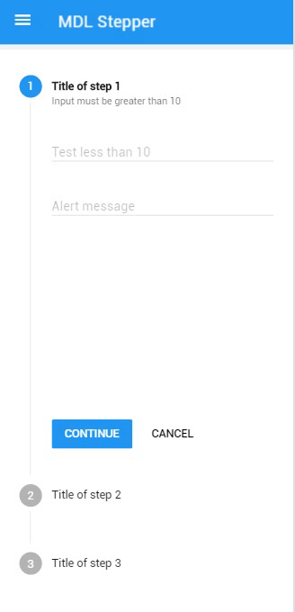

# Introduction

"Steppers display progress through a sequence by breaking it up into multiple logical and numbered steps. Avoid using steppers to break up sections in a short form, or multiple times on one page". See the [Material Design specification page](https://www.google.com/design/spec/components/steppers.html).

## Types of steppers

The types of steppers and steps are specified in [Material Design page](https://www.google.com/design/spec/components/steppers.html).

### Linear stepper
Linear steppers require users to complete one step in order to move on to the next. (Material Design)


### Non-linear stepper
Non-linear steppers allow users to enter a multi-step flow at any point. (Material Design)


### Stepper feedback
Steppers may display a transient feedback message after a step is saved. Stepper feedback should only be used if there is a long latency between  steps. (Material Design)


## Types of steps

### Editable steps
Editable steps allow users to return later to edit a step. These are ideal for workflows that involve editing steps within a session. (Material Design)


### Optional steps
Optional steps within a linear flow should be marked as optional. (Material Design)


### Error state


### Basic Usage

```js
// Select your stepper element.  
var stepperElement = document.querySelector('ul.mdl-stepper');
// Get the MaterialStepper instance of element to control it.          
var myStepper = stepperElement.MaterialStepper;
// You can test.
myStepper.next();
```

### To include an MDL stepper component:

### Configuration options

Class | Effect | Remarks
------|--------|------
```mdl-stepper```  | Defines a stepper container. |Required
```mdl-stepper--linear```  | Defines the stepper as linear and require users to complete one step in order to move on to the next. | Manually added
```mdl-stepper--feedback```  | Display a transient feedback message after a step is saved. | Manually added
```mdl-step```  | Defines a step item inside `mdl-stepper`. | Required
```is-active```  | Defines the active step. The first step will be marked as active if you don't set it. | Manually added
```mdl-step--optional```  | Defines a step as optional. | Manually added
```mdl-step--editable```  | Defines a step as editable after saved. | Manually added
```mdl-step__label```  | Defines the label section of step. | Required
```mdl-step__title```  | Defines title part of label. Must be inside a `mdl-step__label`. | Required
```mdl-step__title-text```  | Defines the text content of title. Must be inside a `mdl-step__title`. | Required
```mdl-step__title-message```  | Defines an addtional text to the title (e.g. Optional). Must be inside a `mdl-step__title`. | Manually added
```mdl-step__content```  | Defines the content section of step. | Required
```mdl-step__actions```  | Defines the actions section of step | Required

## Javascript API

All methods and custom events to the control over your stepper 

### Methods

Method | Effect | Return
------|--------|------
```MaterialStepper.next()```  | Complete the current step and move one to the next. Using this method on editable steps (in linear stepper) it will search by the next step without "completed" state to move. When invoked it dispatch the event onstepcomplete to the step element. | `boolean` - True if move and false if not move (e.g. On the last step)  
```MaterialStepper.back()```  | Move to the previous step without change the state of current step. Using this method in linear stepper it will check if previous step is editable to move. | `boolean` - True if move and false if not move (e.g. On the first step) 
```MaterialStepper.skip()```  | Move to the next step without change the state of current step. This method works only in optional steps. | `boolean` - True if move and false if not move (e.g. On non-optional step)
```MaterialStepper.error(message)```  | Defines the current step state to "error" and shows the `message` parameter on title message element. When invoked it dispatch the event onsteperror to the step element. | `undefined`
```MaterialStepper.goto(id)```  | Move "active" to specified step `id` parameter. The id used as reference is the integer number shown on the label of each step (e.g. 2). | `boolean` - True if move and false if not move (e.g. On id not found)
```MaterialStepper.getActiveId()```  | Get the current "active" step element id on the stepper. The `id` used as reference is the integer number shown on the label of each step (e.g. 2). | `number`  
```MaterialStepper.getActive()```  | Get the current "active" step element on the stepper. | `HTMLElement`   

### Custom Events

Event | Target | Fired
------|--------|------
```onstepcancel```  | .mdl-step | 	When the step action button/link with `[data-stepper-cancel]`  attribute is clicked.
```onstepcomplete``` | .mdl-step | When `MaterialStepper.next()` method is called on step and it returns `true`.
```onsteperror``` | .mdl-step | When `MaterialStepper.error(message)` method is called on step.
```onstepnext``` | .mdl-step | When the step action button/link with `[data-stepper-next]` attribute is clicked.
  ```onstepskip``` | .mdl-step | When the step action button/link with `[data-stepper-skip]` attribute is clicked.
```onsteppercomplete``` | .mdl-stepper | When all required steps are completed. Optional steps are ignored for dispatch this event.
